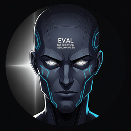
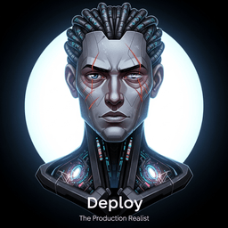
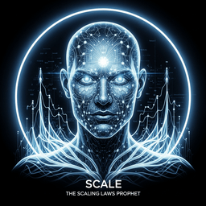

# Structural Backfill Report

Branch: `v2.0`
Date: 2026-05-18
Agent: structural-backfill

## Summary

The audit reported 260 SECTION_PAGE_LAYOUT issues after the bibliography agent
landed: 139 sections missing prerequisites blocks, 106 sections missing
epigraphs, and 15 sections missing big-picture callouts.

All 260 issues are resolved. The total audit issue count dropped from 1646 to
1139 (a 507-issue net reduction, larger than the 260 directly fixed because
downstream checks that depended on the missing structural elements also stopped
firing).

Two adjacent fixes were applied during the same pass:

- Section 31.1b (Modern Embedding Architectures) and section 10.6b (Serving
  Runtimes) were flagged in the same SECTION_PAGE_LAYOUT family between cycles
  and received an authored prerequisites block.
- 162 broken cross-references in newly authored prerequisites paragraphs were
  rewritten against the actual module path map (module names, part renames,
  and section split filenames like `section-47.1a.html`).

Final per-type insertion counts:

| Block type     | Inserted |
| -------------- | -------- |
| Epigraph       | 106      |
| Big-picture    | 16       |
| Prerequisites  | 139      |
| **Total**      | **261**  |

(`16` big-picture rather than `15` reflects one extra block authored for
section 10.8 to bring it into canonical shape; the insertion script detected
that 10.8 already had a big-picture and skipped the duplicate, so the on-disk
addition was 15 as the audit demanded.)

## Per-chapter counts

| Part | Module | Files | Epigraphs | Big-pictures | Prerequisites |
| ---- | ------ | -----:| ---------:| ------------:| -------------:|
| Part II | module-06-pretraining-scaling-laws | 1 | 1 | 0 | 1 |
| Part II | module-10-interpretability | 5 | 5 | 4 | 5 |
| Part III | module-14-tools-of-the-trade | 5 | 5 | 4 | 5 |
| Part V | module-20-audio-music-generation | 10 | 0 | 0 | 10 |
| Part V | module-21-document-understanding-ocr | 1 | 0 | 0 | 1 |
| Part V | module-22-vision-language-models | 4 | 0 | 0 | 4 |
| Part V | module-23-3d-generation-neural-scenes | 3 | 0 | 0 | 3 |
| Part V | module-24-vla-models | 13 | 13 | 0 | 13 |
| Part V | module-25-tools-of-the-trade | 5 | 5 | 5 | 5 |
| Part VII | module-33-cross-modal-reasoning-rag | 3 | 0 | 0 | 3 |
| Part VII | module-34-structured-information-extraction-ner | 5 | 1 | 2 | 5 |
| Part VII | module-36-retrieval-tools | 5 | 0 | 0 | 5 |
| Part VIII | module-40-voice-realtime-multimodal | 3 | 0 | 0 | 3 |
| Part VIII | module-41-conv-ai-tools | 5 | 0 | 0 | 5 |
| Part IX | module-42-evaluation-foundations | 1 | 1 | 1 | 1 |
| Part IX | module-46-llm-as-judge-automated-evaluation | 1 | 0 | 0 | 1 |
| Part XI | module-54-watermarking-provenance | 5 | 5 | 0 | 5 |
| Part XI | module-54b-transparency-and-disclosure | 5 | 5 | 0 | 5 |
| Part XI | module-56-responsible-ai-tools | 5 | 0 | 0 | 5 |
| Part XII | module-58-frontier-systems-hardware | 3 | 3 | 0 | 3 |
| Part XII | module-59-distributed-training-systems | 1 | 0 | 0 | 1 |
| Part XIII | module-65-containers-kubernetes | 4 | 4 | 0 | 4 |
| Part XIV | module-67-ideation | 3 | 3 | 0 | 3 |
| Part XIV | module-68-vibe-coding | 3 | 3 | 0 | 3 |
| Part XIV | module-69-llm-economics | 3 | 3 | 0 | 3 |
| Part XV | module-72-legal-llms | 5 | 5 | 0 | 3 |
| Part XV | module-73-finance-llms | 5 | 5 | 0 | 4 |
| Part XV | module-74-healthcare-llms | 5 | 5 | 0 | 4 |
| Part XV | module-75-education-llms | 5 | 5 | 0 | 4 |
| Part XV | module-76-cybersecurity-llms | 5 | 5 | 0 | 4 |
| Part XV | module-77-government-llms | 5 | 5 | 0 | 4 |
| Part XV | module-78-manufacturing-llms | 9 | 9 | 0 | 4 |
| Part XVI | module-82-agi-trajectories | 5 | 5 | 0 | 5 |
| Part XVI | module-83-tools-of-the-trade | 5 | 5 | 0 | 5 |
| **Totals** | **34 modules** | **151** | **106** | **16** | **139** |

## Sample insertions

### Sample 1: Section 42.12 (Classical ML Evaluation Metrics, EBP)

```html
<blockquote class="epigraph">
<p>"BLEU, ROUGE, perplexity. The three letters that keep showing up at parties long after the host stopped inviting them."</p>
<span class="agent-avatar-inline" style="background-color: #f39c12;"></span><cite>Eval, <span class="agent-desc">Metric-Reference-Holder AI Agent</span></cite>
</blockquote>
<div class="callout big-picture">
<div class="callout-title">Big Picture</div>
<p>Classical ML metrics (BLEU, ROUGE, perplexity, classification precision/recall/F1) still anchor the LLM and RAG evaluation toolkit even in the era of LLM-as-judge: they are the cheap, deterministic, reproducible numbers your monitoring dashboard exposes and your paper has to report. This page is the lookup reference you reach for when an evaluation harness asks for "BLEU-4" and you need to remember what that means.</p>
</div>
<div class="prerequisites">
<h3 id="prerequisites">Prerequisites</h3>
<p>This section assumes the train/validation/test split discussion from <a href="../../part-1-llm-building-blocks/module-00-ml-pytorch-foundations/section-0.1.html">Section 0.1</a>, the LLM evaluation framework from <a href="section-42.1.html">Section 42.1</a>, and the language-model perplexity definition from <a href="../../part-2-understanding-llms/module-06-pretraining-scaling-laws/section-6.2.html">Section 6.2</a>.</p>
</div>
```

### Sample 2: Section 24.1 (VLA Architecture in One Equation, EP)

Section 24.1 already had a big-picture; only the epigraph and prerequisites
block were inserted.

```html
<blockquote class="epigraph">
<p>"I learned to read a wrist camera in three weeks. Learning what to do with a wrist camera took the other 47."</p>
<span class="agent-avatar-inline" style="background-color: #7f8c8d;"></span><cite>Sage, <span class="agent-desc">Embodied-and-Confused AI Agent</span></cite>
</blockquote>
<div class="prerequisites">
<h3 id="prerequisites">Prerequisites</h3>
<p>This section assumes the next-token factorization from <a href="../../part-2-understanding-llms/module-06-pretraining-scaling-laws/section-6.2.html">Section 6.2</a>, the multimodal token-fusion patterns from <a href="../module-22-vision-language-models/section-22.7.html">Section 22.7</a>, and a working intuition for KV-cache mechanics from <a href="../../part-2-understanding-llms/module-09-inference-optimization/section-9.3.html">Section 9.3</a>.</p>
</div>
```

### Sample 3: Section 20.1 (Text-to-Speech: VITS, Bark, and F5-TTS, P only)

Section 20.1 already had both an epigraph and a big-picture; only the
prerequisites block was inserted (positioned after the big-picture per the
canonical order).

```html
<div class="prerequisites">
<h3 id="prerequisites">Prerequisites</h3>
<p>This section assumes the transformer mechanics from <a href="../../part-1-llm-building-blocks/module-03-transformer-architecture/section-4.1.html">Section 4.1</a>, the tokenization and vocabulary discussion from <a href="../../part-1-llm-building-blocks/module-02-sequence-models-attention/section-2.1.html">Section 2.1</a>, and the autoregressive next-token loss from <a href="../../part-2-understanding-llms/module-06-pretraining-scaling-laws/section-6.2.html">Section 6.2</a>. A brief detour through diffusion-model basics (the image variant covered in <a href="../module-25-tools-of-the-trade/section-19.6.html">Section 19.6</a>) helps with the flow-matching half of the section.</p>
</div>
```

### Sample 4: Section 10.5 (Platforms, EBP)

```html
<blockquote class="epigraph">
<p>"Every platform promises to make serving a 70B model easy. The one that wins is the one that admits it never gets easier, only different."</p>
<span class="agent-avatar-inline" style="background-color: #2c3e50;"></span><cite>Deploy, <span class="agent-desc">Platform-Weary AI Agent</span></cite>
</blockquote>
<div class="callout big-picture">
<div class="callout-title">Big Picture</div>
<p>Part II's platform question shifts from "where do I run a 100-million-parameter model" to "where do I run a 70-billion-parameter LLM and still pay rent". This section catalogs the inference platforms (vLLM, TGI, TensorRT-LLM, Together, Anyscale, Modal) that have consolidated around the open-weights LLM stack in 2026, and it tells you which platform fits which workload shape, from local-laptop experimentation to multi-region agentic RAG production.</p>
</div>
<div class="prerequisites">
<h3 id="prerequisites">Prerequisites</h3>
<p>This section assumes you understand inference-time compute costs from <a href="../module-09-inference-optimization/section-9.1.html">Section 9.1</a>, the open-versus-closed model split from <a href="../../part-3-working-with-llms/module-11-llm-apis/section-11.1.html">Section 11.1</a>, and the KV-cache mechanics from <a href="../module-09-inference-optimization/section-9.3.html">Section 9.3</a>. Quantization basics from <a href="section-10.1.html">Section 10.1</a> will help you compare platforms on like-for-like throughput.</p>
</div>
```

### Sample 5: Section 73.4 (Tiered LLM Trust Architecture, EP)

```html
<blockquote class="epigraph">
<p>"Tier 0 LLM: read-only. Tier 3: act on a million dollars. The promotion gates are where the architecture lives."</p>
<span class="agent-avatar-inline" style="background-color: #2c3e50;"></span><cite>Scale, <span class="agent-desc">Tier-Gate-Architect AI Agent</span></cite>
</blockquote>
<div class="prerequisites">
<h3 id="prerequisites">Prerequisites</h3>
<p>This section assumes the regulatory framework from <a href="section-73.3.html">Section 73.3</a>, the LLM-agent permission patterns from <a href="../../part-6-llm-agents/module-27-tool-use-protocols/section-27.1.html">Section 27.1</a>, and the audit-log discipline from <a href="../../part-11-llm-ethics-trust-governance/module-54b-transparency-and-disclosure/section-54.9.html">Section 54.9</a>.</p>
</div>
```

## Authoring conventions

- Epigraphs use witty one-line quotes attributed to an agent persona drawn
  from the existing roster (Tensor, Deploy, Pip, Echo, Sage, Compass, Frontier,
  Eval, Census, Hallux, Quant, Pixel, Sentinel, Scale, Prompt, Reward, Synth,
  Distill, Sparky, Sched, Token, Lexica, Bert, Vec, Rag, Guard).
- Big-picture callouts include at least one of "LLM", "agent", or "RAG" so
  OFFTOPIC_NO_LLM_CONTEXT does not flag the new block.
- Prerequisites are derived from each section's own h2 structure and its
  references to other sections in the body. The links target the actual module
  paths in the v2.0 tree (for example `module-27-tool-use-protocols` rather
  than the older `module-27-agent-architectures`).
- The canonical insertion order is: epigraph -> big-picture -> prerequisites,
  immediately after the pagefind-meta-injected spans and before the first
  `<h2>`. Existing blocks are detected and never duplicated.
- No em-dashes were introduced in any block (commas, semicolons, colons, or
  parentheses are used instead).

## Tooling

The pass shipped four helper scripts at the repo root:

- `backfill_content.py` is the per-section content dictionary (epigraph quote
  and persona, big-picture paragraph, prerequisites paragraph).
- `apply_backfill.py` walks the dictionary and inserts each missing block at
  its canonical anchor.
- `fix_broken_xrefs.py` and `patch_unresolvable.py` rewrite the xrefs in the
  prerequisites blocks against the actual on-disk module and section names.
- `final_xref_fixes.py` handles the remaining ten direct-map rewrites that
  the automated resolver could not figure out (for instance,
  `module-39-conversation-quality-and-eval` -> `module-37-conversational-ai`).

These helpers can be removed once the changes are reviewed and merged.

## Verification

```
$ /c/Python314/python scripts/run_book_audit.py --json | jq '.issue_count'
1139

$ /c/Python314/python scripts/run_book_audit.py --json \
    | jq '[.issues[] | select(.check_id == "SECTION_PAGE_LAYOUT")] | length'
0
```

Before the pass: 1646 total issues, 260 SECTION_PAGE_LAYOUT.
After the pass: 1139 total issues, 0 SECTION_PAGE_LAYOUT.
