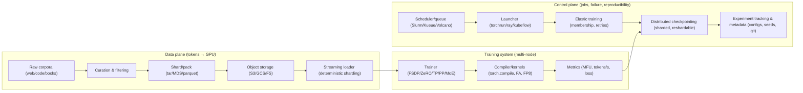
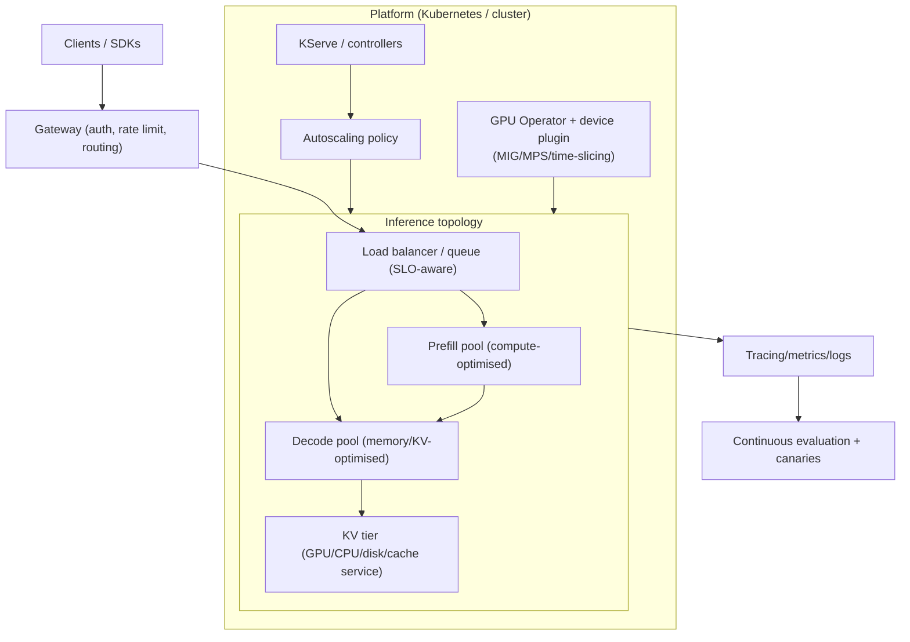

# Large-scale training and deployment content gaps in LLMBook (2023–2026)

## Executive summary

LLMBook already provides strong conceptual coverage of large-model scaling fundamentals (including distributed training patterns such as data parallelism, sharding, tensor/pipeline parallelism, and long-context parallelism) and a modern survey of inference-serving frameworks (including continuous batching, KV-cache management, and prefill/decode disaggregation). citeturn3view0turn4view0turn4view3 It also includes practical production chapters covering web/API architecture, containerisation, cloud deployment, and serverless deployment options, plus an observability chapter focused on tracing and drift detection. citeturn22view0turn21view0

From the perspective of building, training, fine-tuning, and deploying large LLMs at scale, the largest missing or underdeveloped areas are *systems-level, end-to-end reliability and portability* across (a) accelerators (TPU/JAX and non-CUDA stacks), (b) failure domains (elastic/fault-tolerant training, distributed checkpointing, object-store checkpoint pipelines), (c) data-plane efficiency at trillion-token scale (streaming/sharded datasets and dataloader correctness), and (d) cluster orchestration in shared environments (Kubernetes-native queueing/gang scheduling/topology awareness and production serving on Kubernetes). citeturn3view0turn5view3turn9search1turn9search2turn9search3turn14search1turn14search2turn10search15turn10search7

A second class of gaps concerns the “new normal” of 2023–2026 performance engineering and research frontier tooling: compiler-based acceleration for training (torch.compile/TorchInductor), fused attention kernels (FlashAttention), FP8/FP4 training toolchains (Transformer Engine), automatic parallelism planners (e.g., Mist/Aceso/Alpa), low-bit communication optimisations (LoCo), and recent tail-latency/scheduling systems for inference (Sarathi-Serve, Llumnix) alongside KV-cache reuse/compression/offload systems (CacheGen, LMCache, InfiniGen). citeturn13search0turn13search16turn13search1turn13search22turn19search3turn19search2turn19search0turn20search0turn10search1turn10search5turn20search10turn10search2turn10search10turn20search9 Finally, the book would benefit from explicitly anchoring “scale” decisions to standardised benchmark suites (MLPerf Training/Inference) and up-to-date benchmarking tools (noting that GenAI-Perf is being phased out and AIPerf is positioned as the successor). citeturn16search1turn16search0turn16search4turn20search3turn20search31

## Narrative analysis

The book’s current training-at-scale coverage emphasises *parallelism primitives* and memory-saving strategies (e.g., sharding/ZeRO/FSDP and activation checkpointing), which is necessary but not sufficient for large runs measured in *weeks of wall-clock time and hundreds of TB of I/O*. citeturn5view4turn5view3 In modern large-scale practice, a training run’s success rate hinges on fault models (node preemption, transient network failures), restart semantics (elastic world-size changes), and checkpoint throughput to object storage with resharding-aware formats—topics directly supported by “Distributed Checkpoint” and “Torch Distributed Elastic” in the PyTorch ecosystem but not foregrounded as core training systems content. citeturn9search1turn9search2

Similarly, inference optimisation content correctly surveys major serving engines and introduces disaggregated prefill/decode, but the state of the art (2023–2026) increasingly comes from *systems research and production schedulers* that address tail latency, stalls, and multi-instance routing, and from KV-cache systems that treat caches as a first-class distributed memory tier. citeturn4view3turn10search1turn20search10turn10search2turn10search10turn20search9 The production chapters cover cloud/serverless deployment patterns broadly, yet scale deployments in shared clusters are commonly *Kubernetes-first*, demanding practical treatment of GPU operators, MIG/MPS-based sharing, queueing/admission control (Kueue), and gang/topology-aware scheduling to avoid deadlocks and underutilisation. citeturn22view0turn10search15turn14search0turn14search11turn14search23turn14search1turn14search2turn14search13

Finally, frontier training performance engineering has shifted towards compilers and fused kernels (torch.compile, FlashAttention, Transformer Engine FP8/FP4), while portability has expanded beyond CUDA to TPU/JAX stacks (MaxText) and non-NVIDIA accelerators (ROCm, Gaudi). citeturn13search0turn13search22turn13search1turn9search0turn17search0turn18search23 Bringing these missing components into the book would turn “distributed training” and “serving” from conceptual modules into an end-to-end, reproducible, failure-aware blueprint for real large-scale training and operations.

## Scope and criteria

Gaps below prioritise (i) topics that change engineering feasibility/cost at scale, (ii) areas with strong 2023–2026 primary-source tooling or papers, and (iii) content that complements—rather than repeats—the book’s existing parallelism and serving-framework surveys. citeturn3view0turn4view0turn22view0

## Mermaid diagrams

| Missing item                                                                                      | Short description                                                                                                                                      | Why it matters                                                                                                                                                                                                                                                       | Suggested subtopics/sections                                                                                                                                                 | Concrete tools/libraries/frameworks (links to primary sources: GitHub, official docs, papers)                                                                                                                                                                                                                                                | Example lab or capstone exercise                                                                                                                                                                                                 | Estimated implementation effort (low/medium/high) | Priority (critical/important/optional) |
| ------------------------------------------------------------------------------------------------- | ------------------------------------------------------------------------------------------------------------------------------------------------------ | -------------------------------------------------------------------------------------------------------------------------------------------------------------------------------------------------------------------------------------------------------------------- | ---------------------------------------------------------------------------------------------------------------------------------------------------------------------------- | -------------------------------------------------------------------------------------------------------------------------------------------------------------------------------------------------------------------------------------------------------------------------------------------------------------------------------------------- | -------------------------------------------------------------------------------------------------------------------------------------------------------------------------------------------------------------------------------- | ------------------------------------------------- | -------------------------------------- |
| TPU/JAX-based large-scale training (MaxText)                                                      | A first-class path for training LLMs on TPUs (and JAX/XLA GPU backends) with modern SPMD partitioning and high MFU.                                    | TPU clusters (and JAX-first stacks) are common in frontier training; portability reduces vendor lock-in and improves research reproducibility across hardware. citeturn9search0turn0search24                                                                     | JAX/XLA mental model; SPMD + sharding; pjit/mesh; input pipelines on TPU; checkpointing; profiling MFU; “GPU vs TPU” trade-offs.                                             | MaxText repo + docs. citeturn9search0turn9search28 Practical TPU cluster tutorial (MaxText + Ray Train on GKE). citeturn9search12                                                                                                                                                                                                     | Train a small Llama-style model (e.g., 1–3B) on TPU using MaxText; measure steps/s and MFU; reproduce on GPU; document differences in sharding and I/O. citeturn9search0turn9search12                                        | High                                              | Important                              |
| Production-grade multi-dimensional training stack (Megatron Core / Megatron-LM / Megatron-Bridge) | Concrete recipes for multi-axis parallelism (TP/PP/CP/MoE) with modern checkpoint formats and integrations.                                            | Many real pretraining runs are built atop Megatron-derived stacks; researchers benefit from reproducible configs, distributed checkpoint best practices, and reference pipelines beyond “concepts”. citeturn18search6turn17search28turn18search10turn9search33 | Megatron Core architecture; composing TP+PP+DP+CP; MoE load-balancing; dist ckpt; HF↔Megatron conversion; performance tuning playbook.                                       | Megatron-LM repo. citeturn18search6 Megatron Core docs. citeturn17search28turn18search14 NeMo Megatron-Bridge repo/docs. citeturn18search10turn18search30                                                                                                                                                                         | Reproduce a published parallelism config (e.g., TP×PP×DP) on a small cluster; validate checkpoint convert HF↔Megatron; measure comm/compute overlap and throughput. citeturn18search10turn17search28                         | High                                              | Critical                               |
| Compiler + kernel optimisation for training (torch.compile, FlashAttention, FP8/FP4 toolchains)   | Performance engineering content for compiler graphs, graph breaks, fused kernels, and low-precision training toolchains.                               | At scale, a few percentage points of MFU translate to huge time/cost savings; 2023–2026 training stacks increasingly rely on torch.compile/Inductor, FlashAttention, and FP8/FP4 tooling. citeturn13search0turn13search16turn13search22turn13search1           | torch.compile programming model; TorchInductor/Triton; attention kernel selection; FP8/FP4 recipes; correctness pitfalls (numerics, determinism); benchmarking MFU.          | torch.compile tutorial + compiler docs. citeturn13search0turn13search16turn13search24 Transformer Engine repo + FP8 primer. citeturn13search1turn13search5turn13search17 FlashAttention (FA3 context). citeturn13search22turn13search14                                                                                        | Take a baseline PyTorch training loop; enable torch.compile; add FlashAttention + FP8; quantify throughput and memory changes; write a reproducibility checklist for numerics. citeturn13search0turn13search22turn13search1 | Medium                                            | Critical                               |
| Elastic/fault-tolerant training + distributed checkpoint I/O                                      | Training resiliency: restart semantics, world-size elasticity, and sharded checkpoint pipelines that can reshard on restore.                           | Long multi-node jobs fail; without elastic launch + fast distributed checkpoints, utilisation collapses and resumed training becomes fragile. citeturn9search2turn9search1turn9search17                                                                         | Torch Distributed Elastic concepts; DCP state_dict semantics and resharding; async checkpoint staging; checkpoint frequency trade-offs; object-store checkpoint performance. | Torch Distributed Elastic docs. citeturn9search2 Distributed Checkpoint (DCP) docs + recipe. citeturn9search1turn9search5 Large-scale checkpointing guidance. citeturn9search17 Object store integration example (S3 connector). citeturn9search21                                                                              | Implement DCP for an FSDP/FSDP2 model; launch with elastic training; inject worker failure; verify resumed convergence and resharding across world sizes. citeturn9search2turn9search5turn13search3                         | High                                              | Critical                               |
| Streaming/sharded dataset pipelines for multi-node training                                       | Practical data-path content: streaming datasets, shard formats, deterministic sampling, caching, and throughput debugging.                             | Data loading is often the bottleneck at scale; correctness (no overlap across ranks, stable shuffling, resumability) is necessary for reproducible science and stable training. citeturn9search3turn18search0turn18search1                                      | Shard formats (tar/MDS/parquet); deterministic sharding; resumable iterators; caching (local + remote); profiling data stalls; integrity checks.                             | Mosaic Streaming repo + docs. citeturn9search3turn9search15 WebDataset repo. citeturn18search0turn18search12 HF datasets streaming docs + streaming improvements context. citeturn18search1turn18search21                                                                                                                        | Build a streaming pipeline for FineWeb/Dolma; measure dataloader throughput vs GPU tokens/s; add rank-wise non-overlap checks and resumable iteration. citeturn23search4turn23search2turn9search15turn18search0            | Medium                                            | Critical                               |
| Automatic parallelism planners & configuration search                                             | Tools that search the parallelism/config space automatically (co-optimising memory + parallelism + overlap).                                           | Manual parallelism tuning is error-prone and expensive; planners reduce time-to-train and enable systematic research on scaling behaviour. citeturn19search3turn19search2turn19search0                                                                          | Formulating the search space (DP/TP/PP/CP); cost models; profiling-guided search; constraints (memory, interconnect); integration points with PyTorch/JAX.                   | Mist repo + paper. citeturn19search3turn19search7turn19search30 Aceso repo. citeturn19search2 Alpa repo. citeturn19search0                                                                                                                                                                                                        | Replicate a planner paper on a small cluster: fixed model size, vary network topologies; compare planner-chosen config vs hand-tuned baseline. citeturn19search3turn19search2                                                | High                                              | Optional                               |
| Low-bit communication & comm-efficient training (LoCo)                                            | Modern communication compression aimed at reducing bandwidth pressure in distributed training.                                                         | Communication is a hard scaling limit; low-bit comm can raise scaling efficiency in bandwidth-constrained clusters. citeturn7view2turn20search8turn20search0                                                                                                    | Where comm dominates (all-reduce/reduce-scatter); error feedback vs naive quantisation; integration with ZeRO/FSDP; measurement methodology (step time vs convergence).      | LoCo code repo + paper. citeturn20search0turn20search8                                                                                                                                                                                                                                                                                   | Integrate LoCo-style comm compression in a small distributed run; measure step-time reduction and verify convergence parity to BF16 baseline. citeturn20search0turn20search8                                                 | Medium                                            | Optional                               |
| Cross-vendor accelerator stacks (ROCm + Gaudi)                                                    | Hands-on guidance for training/serving outside CUDA: ROCm training/inference stacks and Gaudi/SynapseAI paths.                                         | Hardware diversity matters for cost and availability; research teams increasingly need credible non-CUDA baselines and portability guidance. citeturn17search0turn17search1turn17search3turn18search23                                                         | ROCm ecosystem overview; ROCm training with Megatron-LM; ROCm inference with vLLM; ROCm Transformer Engine; Gaudi pretraining paths and DeepSpeed integration.               | ROCm Megatron-LM training guide. citeturn17search0turn17search12 ROCm vLLM inference guide / install notes. citeturn17search1turn17search5 ROCm Transformer Engine repo. citeturn17search2 Gaudi/SynapseAI + DeepSpeed integration note. citeturn17search3 Gaudi pretraining guide (Megatron-DeepSpeed). citeturn18search23 | Compare the same model’s throughput and cost on CUDA vs ROCm (and optionally Gaudi): document kernel gaps, supported dtypes, and deployment friction. citeturn17search1turn17search5turn18search23                          | High                                              | Important                              |
| Kubernetes-native GPU scheduling & training orchestration                                         | Job queueing, admission control, and gang/topology-aware scheduling for distributed training on shared clusters.                                       | Most org-scale clusters are multi-tenant; queueing plus gang scheduling prevents deadlocks and improves fairness/utilisation for multi-pod training jobs. citeturn14search1turn14search2turn14search13turn15search13                                           | Kueue concepts (Workload admission, quotas); Volcano batch scheduling; gang scheduling primitives; Kubeflow Trainer CRDs; topology-aware placement.                          | Kueue repo. citeturn14search1turn14search34 Volcano repo. citeturn14search2 Gang scheduling KEP. citeturn14search13 Kubeflow PyTorchJob docs + Trainer repo. citeturn15search0turn15search13turn15search17                                                                                                                    | Deploy a multi-node training job (e.g., PyTorchJob) with gang scheduling; add quotas and priorities; observe queueing behaviour under contention. citeturn15search0turn15search29turn14search1                              | High                                              | Critical                               |
| Kubernetes production LLM serving + GPU sharing (KServe + GPU Operator + MIG/MPS)                 | Production-grade, Kubernetes-native serving patterns for LLM engines with GPU lifecycle management and safe sharing.                                   | Real deployments often require multi-model and multi-tenant isolation; MIG/MPS and operators directly impact cost-per-token and SLO compliance. citeturn10search15turn10search7turn14search0turn14search11turn14search23                                      | KServe runtimes for vLLM/TGI; deployment CRDs; device plugins/GPU operator; MIG partitioning; MPS; health checks; canary rollouts.                                           | KServe repo + framework overview. citeturn10search15turn10search11 vLLM ↔ KServe integration docs. citeturn10search7turn10search3 GPU Operator repo + docs. citeturn14search0turn14search4 MIG user guide + Kubernetes MIG support. citeturn14search11turn14search3 CUDA MPS docs. citeturn14search23                     | Deploy vLLM on KServe; enable MIG partitions; A/B test two quantisation settings; measure TTFT/TPOT under concurrency with a load generator. citeturn10search7turn14search11turn11view0                                     | High                                              | Critical                               |
| LLM-specific serverless inference systems (cold-start + checkpoint locality)                      | Systems approaches to serverless LLM inference emphasising fast checkpoint loading and locality-aware caching.                                         | General serverless platforms are covered, but LLM cold-start bottlenecks are dominated by multi-GB checkpoints and cache locality; dedicated systems methods have emerged. citeturn22view0turn10search12turn10search0                                           | Cold-start anatomy; checkpoint caching tiers; locality-aware placement; multi-tenant isolation; cost models (scale-to-zero vs warm pools).                                   | ServerlessLLM repo + OSDI’24 paper. citeturn10search0turn10search12 (Optional operational complement) multi-cloud serving/replicas. citeturn15search5turn15search2                                                                                                                                                                   | Replicate ServerlessLLM cold-start experiments (small model); measure end-to-end cold vs warm latency; evaluate checkpoint caching policy sensitivity. citeturn10search12turn10search0                                       | High                                              | Optional                               |
| Tail-latency aware scheduling & multi-instance routing for inference (Sarathi-Serve, Llumnix)     | Research/production schedulers that reduce stalls and improve tail latency under high concurrency and heterogeneous traffic.                           | Book benchmarks throughput/latency trade-offs, but recent systems show concrete scheduling mechanisms (chunked prefill, request migration) that matter operationally. citeturn4view3turn10search1turn20search10                                                 | Chunked prefill + stall-free schedules; cross-instance scheduling; request migration; priority/SLO differentiation; fragmentation avoidance.                                 | Sarathi-Serve repo + OSDI’24 paper. citeturn10search5turn10search1 Llumnix repo + OSDI’24 description. citeturn20search2turn20search10turn20search6                                                                                                                                                                                 | Reproduce one workload trace: compare vLLM baseline vs Sarathi-Serve or Llumnix-style scheduling; report P50/P99 TTFT and throughput. citeturn10search1turn10search5turn20search10                                          | High                                              | Important                              |
| KV cache reuse/compression/offload at datacentre scale (CacheGen, LMCache, InfiniGen)             | KV cache treated as a tiered/distributed resource: streaming/compressing caches, reusing caches across requests, and dynamic offloading with prefetch. | Long-context workloads are dominated by KV movement and memory; cache-centric systems reduce TTFT and cost without changing the base model. citeturn10search14turn10search10turn20search9                                                                       | KV cache compression vs quality; cache streaming; cross-request reuse (not only prefix); CPU/disk/S3 tiers; predictive prefetch; integration with serving engines.           | CacheGen repo + SIGCOMM’24 paper. citeturn10search2turn10search14turn10search33 LMCache repo. citeturn10search10 InfiniGen repo + OSDI’24 paper. citeturn20search1turn20search9                                                                                                                                                  | Implement cache reuse for a long-context app: benchmark TTFT with/without KV reuse; test CacheGen-style compression on stored KV; measure quality impact. citeturn10search2turn10search10turn20search9                      | High                                              | Important                              |
| Standardised benchmarks & reproducible performance harnesses (MLPerf + AIPerf)                    | Training/inference benchmarking practices anchored to MLPerf suites and modern tooling; explicitly update deprecated tooling references.               | Without standard suites, “performance” claims drift; also, tooling evolves (GenAI-Perf is being phased out; AIPerf is promoted as successor), so documentation needs currency. citeturn16search1turn16search4turn20search3turn20search31                       | MLPerf Training/Inference suite overview; rules/reproducibility; choosing scenarios; reporting; CI integration; workload traces.                                             | MLPerf Training suite + reference impl repo. citeturn16search1turn16search0 MLPerf Inference repo. citeturn16search4 AIPerf repo. citeturn20search31 Deprecation note (GenAI-Perf). citeturn20search3turn20search15                                                                                                            | Build a benchmark harness: run MLPerf-style inference scenarios on two engines; generate a report (TTFT/TPOT/P99); automate nightly regressions. citeturn16search4turn20search31                                             | Medium                                            | Critical                               |

| Missing item                                                                                      | Recommended code repos (links)                                                                                              | Starter templates (links)                                                                                                                       | Datasets / benchmarks (links)                                                                                                                                   |
| ------------------------------------------------------------------------------------------------- | --------------------------------------------------------------------------------------------------------------------------- | ----------------------------------------------------------------------------------------------------------------------------------------------- | --------------------------------------------------------------------------------------------------------------------------------------------------------------- |
| TPU/JAX-based large-scale training (MaxText)                                                      | MaxText repo. citeturn9search0                                                                                           | TPU training tutorial (MaxText + Ray Train on GKE). citeturn9search12 MaxText install guide. citeturn9search28                            | MLPerf Training benchmark suite (to ground throughput claims). citeturn16search1                                                                             |
| Production-grade multi-dimensional training stack (Megatron Core / Megatron-LM / Megatron-Bridge) | Megatron-LM repo. citeturn18search6 NeMo Megatron-Bridge repo. citeturn18search10                                     | Megatron Core user guide. citeturn17search28 Megatron-Bridge performance tuning guide. citeturn18search31                                 | MLPerf Training reference implementations. citeturn16search0                                                                                                 |
| Compiler + kernel optimisation for training (torch.compile, FlashAttention, FP8/FP4 toolchains)   | Transformer Engine repo. citeturn13search1 FlashAttention repo releases. citeturn13search14                           | torch.compile tutorial + core concepts. citeturn13search0turn13search24 Transformer Engine FP8 primer. citeturn13search5                 | MLPerf Training repo (benchmark harness and targets). citeturn16search0                                                                                      |
| Elastic/fault-tolerant training + distributed checkpoint I/O                                      | PyTorch Distributed Checkpoint docs. citeturn9search1 Torch Distributed Elastic docs. citeturn9search2                | DCP “getting started” recipe. citeturn9search5 Efficient checkpointing in large-scale jobs (guidance). citeturn9search17                  | MLPerf Training results/code repositories (stress realistic checkpoint sizes). citeturn16search3                                                             |
| Streaming/sharded dataset pipelines for multi-node training                                       | Mosaic Streaming repo. citeturn9search3 WebDataset repo. citeturn18search0 HF Datasets repo. citeturn18search29    | HF datasets streaming docs. citeturn18search1 Mosaic Streaming docs. citeturn9search15                                                    | FineWeb dataset page. citeturn23search4 Dolma dataset repo. citeturn23search2 DCLM framework/datasets. citeturn23search1                               |
| Automatic parallelism planners & configuration search                                             | Mist repo. citeturn19search3 Aceso repo. citeturn19search2 Alpa repo. citeturn19search0                            | Mist paper (methods & evaluation). citeturn19search7                                                                                         | MLPerf Training suite (for end-to-end comparisons). citeturn16search1                                                                                        |
| Low-bit communication & comm-efficient training (LoCo)                                            | LoCo code repo. citeturn20search0                                                                                        | LoCo paper PDF (method details). citeturn20search8                                                                                           | MLPerf Training (communication-heavy scaling scenarios). citeturn16search1                                                                                   |
| Cross-vendor accelerator stacks (ROCm + Gaudi)                                                    | ROCm Megatron-LM training guide. citeturn17search0 ROCm vLLM inference guide. citeturn17search1                       | vLLM ROCm installation guide. citeturn17search5 Gaudi documentation (SynapseAI). citeturn17search19                                       | MLPerf Training/Inference suites (cross-hardware comparability). citeturn16search1turn16search13                                                            |
| Kubernetes-native GPU scheduling & training orchestration                                         | Kubeflow Trainer repo. citeturn15search13 Kueue repo. citeturn14search1 Volcano repo. citeturn14search2            | PyTorchJob guide (distributed MNIST example). citeturn15search0 Kueue “run a PyTorchJob” task. citeturn15search29                         | MLPerf Training repo (as high-stakes batch workload). citeturn16search0                                                                                      |
| Kubernetes production LLM serving + GPU sharing (KServe + GPU Operator + MIG/MPS)                 | KServe repo. citeturn10search15 GPU Operator repo. citeturn14search0 NVIDIA device plugin repo. citeturn14search20 | vLLM + KServe integration docs. citeturn10search7 MIG-in-Kubernetes guide. citeturn14search3                                              | MLPerf Inference repo (LLM scenarios). citeturn16search4                                                                                                     |
| LLM-specific serverless inference systems (cold-start + checkpoint locality)                      | ServerlessLLM repo. citeturn10search0                                                                                    | OSDI’24 ServerlessLLM paper PDF (experiment design). citeturn10search12                                                                      | MLPerf Inference (latency-sensitive scenarios) + AIPerf. citeturn16search4turn20search31                                                                    |
| Tail-latency aware scheduling & multi-instance routing for inference (Sarathi-Serve, Llumnix)     | Sarathi-Serve repo. citeturn10search5 Llumnix repo. citeturn20search2                                                 | OSDI’24 Sarathi-Serve paper PDF. citeturn10search1 OSDI’24 Llumnix overview. citeturn20search10                                           | MLPerf Inference repo + results repos (validate tail latency claims). citeturn16search4turn16search9                                                        |
| KV cache reuse/compression/offload at datacentre scale (CacheGen, LMCache, InfiniGen)             | CacheGen repo. citeturn10search2 LMCache repo. citeturn10search10 InfiniGen repo. citeturn20search1                | CacheGen SIGCOMM artefact instructions. citeturn10search37                                                                                   | Long-context datasets/benchmarks: FineWeb (for building long-context eval prompts) and MLPerf Inference (serving scenarios). citeturn23search4turn16search4 |
| Standardised benchmarks & reproducible performance harnesses (MLPerf + AIPerf)                    | MLPerf Training repo. citeturn16search0 MLPerf Inference repo. citeturn16search4 AIPerf repo. citeturn20search31   | MLCommons benchmark pages (rules/intent). citeturn16search1turn16search13 (Update note) GenAI-Perf deprecation notice. citeturn20search3 | MLPerf Training/Inference suites + results repos. citeturn16search3turn16search9turn16search19                                                             |