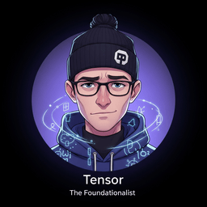

> "Every expert was once a beginner who refused to skip the fundamentals."
>
>  [Tensor](../../front-matter/wisdom-council.html#tensor), Fundamentals-Obsessed AI Agent

**Figure 0.0.1**: Like a builder laying the first bricks, this chapter establishes the essential foundations of machine learning, neural networks, and PyTorch that every subsequent chapter will build upon.
## Chapter Overview
This chapter is your launchpad. Before we can understand how Large Language Models work,
we need to build a solid foundation in machine learning, neural networks, and the tools
we will use throughout the book. Think of this chapter as ensuring everyone speaks the
same language before the real journey begins, from
[NLP fundamentals (Chapter 1)](module-01-foundations-nlp-text-representation_index.html.md)
all the way through to
[building AI agents (Chapter 22)](../../part-6-agentic-ai/module-22-ai-agents/index.html).
We start with the core ideas of machine learning: how machines learn patterns from data,
what can go wrong (overfitting), and how to fix it. Then we dive into neural networks
and the magic of backpropagation, concepts you will see again when we study the
[Transformer architecture (Chapter 4)](module-04-transformer-architecture_index.html.md).
Next, we get our hands dirty with PyTorch, the
framework that powers most modern LLM research and development. Finally, we introduce
reinforcement learning, the paradigm that makes LLMs helpful through RLHF, a topic
explored in full in [Chapter 17: Alignment, RLHF & DPO](../../part-4-training-adapting/module-17-alignment-rlhf-dpo/index.html).
### Prerequisites
- Python proficiency (functions, classes, list comprehensions, decorators)
- Basic linear algebra: vectors, matrices, dot products
- Basic probability: distributions, expectation, Bayes' theorem
- No prior ML experience required
### Learning Objectives
- Explain supervised learning, loss functions, and gradient descent intuitively and mathematically (these resurface in [Chapter 14: Fine-Tuning Fundamentals](../../part-4-training-adapting/module-14-fine-tuning-fundamentals/index.html))
- Describe the bias-variance tradeoff and apply regularization techniques
- Build and train neural networks, understanding backpropagation at a mechanical level
- Write complete PyTorch training loops with custom datasets and GPU acceleration, skills applied throughout [Part 4: Training & Adapting](../../part-4-training-adapting/module-15-peft/index.html)
- Explain the RL framework (agent, policy, reward) and its connection to LLM training via [RLHF and DPO (Chapter 17)](../../part-4-training-adapting/module-17-alignment-rlhf-dpo/index.html)
## Sections
- [0.1
  ML Basics: Features, Optimization & Generalization
  🟢
  📐
  Supervised learning, loss functions, gradient descent, overfitting, regularization,
  bias-variance tradeoff, cross-validation. These optimization concepts carry directly into
  pretraining and scaling (Chapter 6).](module-00-ml-pytorch-foundations_section-0.1.html.md)
- [0.2
  Deep Learning Essentials
  🟢
  📐
  Perceptrons, MLPs, activation functions, backpropagation, batch normalization,
  dropout, CNNs, training best practices. The foundation for understanding
  sequence models and attention (Chapter 3).](module-00-ml-pytorch-foundations_section-0.2.html.md)
- [0.3
  PyTorch Tutorial
  🟢
  ⚙️
  🔧
  Tensors, autograd, nn.Module, DataLoader, training loops, saving/loading models,
  debugging. Includes hands-on lab: build an image classifier. You will use these PyTorch skills in every hands-on module, especially
  PEFT (Chapter 15) and
  inference optimization (Chapter 9).](module-00-ml-pytorch-foundations_section-0.3.html.md)
- [0.4
  Reinforcement Learning Foundations
  🟢
  📐
  Agent-environment loop, policy, value functions, Bellman equation, policy gradients,
  PPO, and how RL connects to LLM training (RLHF). See also
  AI Agents (Chapter 22) for how RL-trained policies power autonomous systems.](module-00-ml-pytorch-foundations_section-0.4.html.md)
### What's Next?
In the next section, [Section 0.1: ML Basics: Features, Optimization & Generalization](module-00-ml-pytorch-foundations_section-0.1.html.md), we begin with the core machine learning concepts (features, optimization, and generalization) that underpin every large language model.
📚 Bibliography & Further Reading
### Foundational Papers
Rumelhart, D. E., Hinton, G. E., & Williams, R. J. (1986). "Learning representations by back-propagating errors." *Nature*, 323(6088), 533–536. [nature.com/articles/323533a0](https://www.nature.com/articles/323533a0)
The landmark paper that popularized backpropagation for training neural networks, forming the basis of all modern deep learning.
Kingma, D. P. & Ba, J. (2015). "Adam: A Method for Stochastic Optimization." *ICLR 2015*. [arxiv.org/abs/1412.6980](https://arxiv.org/abs/1412.6980)
Introduces the Adam optimizer, now the default choice for training most neural networks including LLMs.
Srivastava, N. et al. (2014). "Dropout: A Simple Way to Prevent Neural Networks from Overfitting." *JMLR*, 15(56), 1929–1958. [jmlr.org/papers/v15/srivastava14a.html](https://jmlr.org/papers/v15/srivastava14a.html)
Introduces dropout regularization, one of the most effective techniques for combating overfitting in deep networks.
Schulman, J. et al. (2017). "Proximal Policy Optimization Algorithms." [arxiv.org/abs/1707.06347](https://arxiv.org/abs/1707.06347)
Presents PPO, the reinforcement learning algorithm later used to align LLMs via RLHF.
He, K. et al. (2016). "Deep Residual Learning for Image Recognition." *CVPR 2016*. [arxiv.org/abs/1512.03385](https://arxiv.org/abs/1512.03385)
Introduces residual connections (skip connections), a technique that became essential in Transformer architectures.
### Key Books
Goodfellow, I., Bengio, Y., & Courville, A. (2016). *Deep Learning*. MIT Press. [deeplearningbook.org](https://www.deeplearningbook.org/)
The comprehensive reference for deep learning fundamentals, covering optimization, regularization, and neural network architectures.
Bishop, C. M. (2006). *Pattern Recognition and Machine Learning*. Springer. [microsoft.com/research](https://www.microsoft.com/en-us/research/publication/pattern-recognition-machine-learning/)
A thorough treatment of probabilistic machine learning, useful for understanding the statistical foundations behind gradient-based learning.
Sutton, R. S. & Barto, A. G. (2018). *Reinforcement Learning: An Introduction* (2nd ed.). MIT Press. [incompleteideas.net/book](http://incompleteideas.net/book/the-book-2nd.html)
The definitive textbook on reinforcement learning, covering the agent/environment framework, value functions, and policy gradient methods.
### Tools & Libraries
Paszke, A. et al. (2019). "PyTorch: An Imperative Style, High-Performance Deep Learning Library." *NeurIPS 2019*. [pytorch.org](https://pytorch.org/)
The official PyTorch framework site with tutorials, API documentation, and installation guides.
PyTorch Tutorials. [pytorch.org/tutorials](https://pytorch.org/tutorials/)
Official hands-on tutorials covering tensors, autograd, data loading, and model training from beginner to advanced levels.
scikit-learn: Machine Learning in Python. [scikit-learn.org](https://scikit-learn.org/)
The standard Python library for classical ML algorithms, preprocessing, and evaluation metrics used throughout the ML foundations section.
NumPy Documentation. [numpy.org/doc/stable](https://numpy.org/doc/stable/)
Reference for the numerical computing library that underpins PyTorch tensors and all scientific computing in Python.