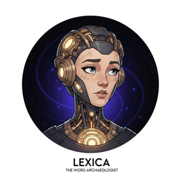

> "A word is characterized by the company it keeps."
>
>  [Lexica](../../front-matter/wisdom-council.html#lexica), Distributional AI Agent
## Chapter Overview
**Every modern AI system that can read, write, or converse began with the ideas in this chapter.**
How do machines learn to read? This chapter traces the evolution of text representation
from counting words to understanding meaning. Building on the neural network and optimization
fundamentals from [Chapter 0: ML & PyTorch Foundations](../module-00-ml-pytorch-foundations/index.html),
we start with the fundamental challenge
of turning raw human language into numbers, work through classical techniques like
Bag-of-Words and TF-IDF, then explore the revolution sparked by Word2Vec and dense
word embeddings.
Along the way, you will build a complete text preprocessing pipeline, train word
embeddings from scratch, explore the famous king/queen analogy, and see how contextual
embeddings (ELMo) paved the road to the transformer models covered in
[Chapter 4: Transformer Architecture](module-04-transformer-architecture_index.html.md).
Understanding this progression is essential: the entire history of NLP is a quest for
better representations of meaning, and each technique you learn here is a building block
for everything that follows.

**Figure 1.0a**: The landscape of core NLP tasks. Each task type reappears throughout this book as we progress from classical methods to LLM-powered solutions.
### Prerequisites
- [Chapter 00: ML & PyTorch Foundations](../module-00-ml-pytorch-foundations/index.html) (especially sections on neural networks and gradient descent)
- Python proficiency (functions, classes, list comprehensions)
- Basic linear algebra: vectors, dot products, matrix multiplication
- Familiarity with NumPy and basic scikit-learn usage
### Learning Objectives
- Explain the evolution of NLP from rule-based systems to modern LLMs (surveyed in [Chapter 7: Modern LLM Landscape](../../part-2-understanding-llms/module-07-modern-llm-landscape/index.html)) and *why* each transition happened
- Build a complete text preprocessing pipeline using spaCy and NLTK
- Implement and compare Bag-of-Words, TF-IDF, and one-hot encoding, and articulate their limitations
- Explain how Word2Vec, GloVe, and FastText create dense word representations and *why* they work
- Train a Word2Vec model from scratch (using techniques from [Chapter 0](../module-00-ml-pytorch-foundations/index.html)) and explore word analogies
- Explain why static embeddings fail for polysemous words and how ELMo introduced contextual embeddings
- Articulate the "big picture" of how text representation evolved toward transformers and LLMs (explored further in [Chapter 6: Pretraining & Scaling Laws](../../part-2-understanding-llms/module-06-pretraining-scaling-laws/index.html))

**Figure 1.1b**: The four eras of NLP, each driven by a breakthrough in how we represent language for machines.
## Sections
- [1.1
  Introduction to NLP & the LLM Revolution
  🟢
  📐
  The four eras of NLP, core NLP tasks, why language is hard,
  and the representation breakthroughs that drove each transition.](module-01-foundations-nlp-text-representation_section-1.1.html.md)
- [1.2
  Text Preprocessing & Classical Representations
  🟢
  ⚙️
  🔧
  The preprocessing pipeline (tokenization, lemmatization, stop words),
  Bag-of-Words, TF-IDF, one-hot encoding, n-grams, and their limitations. Tokenization is explored in depth in Chapter 2.](module-01-foundations-nlp-text-representation_section-1.2.html.md)
- [1.3
  Word Embeddings: Word2Vec, GloVe & FastText
  🟡
  📐
  🔧
  The distributional hypothesis, Skip-gram, negative sampling, word analogies,
  cosine similarity, GloVe co-occurrence matrices, FastText subwords, and t-SNE visualization. These embeddings underpin the retrieval systems in Chapter 19: RAG.](module-01-foundations-nlp-text-representation_section-1.3.html.md)
- [1.4
  Contextual Embeddings: ELMo & the Path to Transformers
  🟡
  📐
  The polysemy problem, ELMo's bidirectional LSTMs, layer-wise representations,
  the pre-train/fine-tune paradigm, and how this led to transformers and LLMs. Continues into Chapter 3: Sequence Models & Attention.](module-01-foundations-nlp-text-representation_section-1.4.html.md)

**Figure 1.2c**: The evolution of text representation. Each step on the staircase solved a critical limitation of the previous approach, culminating in the transformer models that power today's LLMs.
### What's Next?
In the next section, [Section 1.1: Introduction to NLP & the LLM Revolution](module-01-foundations-nlp-text-representation_section-1.1.html.md), we begin with the history and current state of NLP, tracing the paradigm shifts that led to today's LLM revolution.
📚 Bibliography & Further Reading
### Foundational Papers
Mikolov, T. et al. (2013). "Efficient Estimation of Word Representations in Vector Space." [arxiv.org/abs/1301.3781](https://arxiv.org/abs/1301.3781)
The original Word2Vec paper introducing Skip-gram and CBOW, which demonstrated that dense word vectors capture semantic relationships.
Pennington, J., Socher, R., & Manning, C. D. (2014). "GloVe: Global Vectors for Word Representation." *EMNLP 2014*. [nlp.stanford.edu/projects/glove](https://nlp.stanford.edu/projects/glove/)
Introduces GloVe embeddings, which combine global co-occurrence statistics with local context window methods.
Bojanowski, P. et al. (2017). "Enriching Word Vectors with Subword Information." *TACL*, 5, 135–146. [arxiv.org/abs/1607.04606](https://arxiv.org/abs/1607.04606)
Presents FastText, which extends Word2Vec by representing words as bags of character n-grams, enabling embeddings for unseen words.
Peters, M. E. et al. (2018). "Deep contextualized word representations." *NAACL 2018*. [arxiv.org/abs/1802.05365](https://arxiv.org/abs/1802.05365)
Introduces ELMo, the first widely adopted contextual embedding model that generates different vectors for the same word in different contexts.
Harris, Z. S. (1954). "Distributional Structure." *Word*, 10(2-3), 146–162. [doi.org/10.1080/00437956.1954.11659520](https://doi.org/10.1080/00437956.1954.11659520)
The foundational linguistics paper articulating the distributional hypothesis: words that occur in similar contexts tend to have similar meanings.
### Key Books
Jurafsky, D. & Martin, J. H. (2024). *Speech and Language Processing* (3rd ed. draft). [web.stanford.edu/~jurafsky/slp3](https://web.stanford.edu/~jurafsky/slp3/)
The standard NLP textbook, with excellent chapters on text preprocessing, n-gram models, and vector semantics.
Manning, C. D. & Schütze, H. (1999). *Foundations of Statistical Natural Language Processing*. MIT Press. [nlp.stanford.edu/fsnlp](https://nlp.stanford.edu/fsnlp/)
A classic reference for understanding the statistical underpinnings of NLP, including TF-IDF, collocations, and information retrieval.
Goldberg, Y. (2017). *Neural Network Methods for Natural Language Processing*. Morgan & Claypool. [doi.org/10.2200/S00762ED1V01Y201703HLT037](https://doi.org/10.2200/S00762ED1V01Y201703HLT037)
A concise guide bridging classical NLP and neural approaches, covering word embeddings and feed-forward networks for text classification.
### Tools & Libraries
spaCy: Industrial-Strength Natural Language Processing. [spacy.io](https://spacy.io/)
A production-ready NLP library for tokenization, lemmatization, named entity recognition, and text preprocessing pipelines.
NLTK: Natural Language Toolkit. [nltk.org](https://www.nltk.org/)
The classic Python NLP library for educational purposes, providing corpora, stemmers, and text processing utilities.
Gensim: Topic Modelling for Humans. [radimrehurek.com/gensim](https://radimrehurek.com/gensim/)
A Python library for training Word2Vec, FastText, and other embedding models, with efficient similarity queries and corpus handling.
Mikolov, T. et al. (2013). "Distributed Representations of Words and Phrases and their Compositionality." *NeurIPS 2013*. [arxiv.org/abs/1310.4546](https://arxiv.org/abs/1310.4546)
The follow-up Word2Vec paper introducing negative sampling and phrase-level embeddings, with practical training improvements.