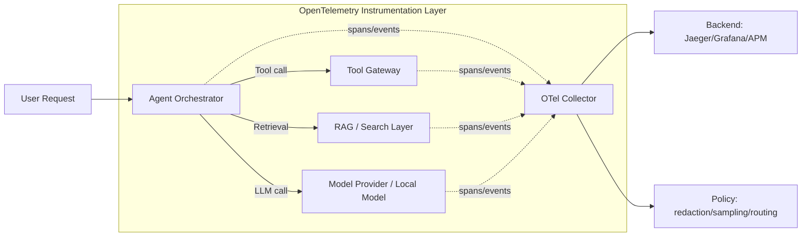
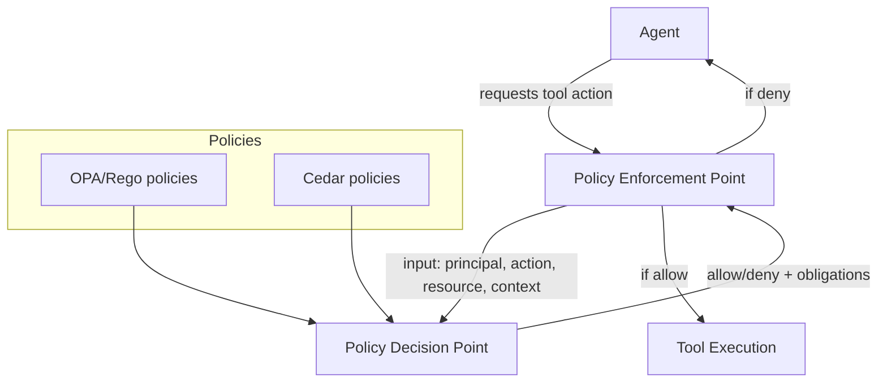
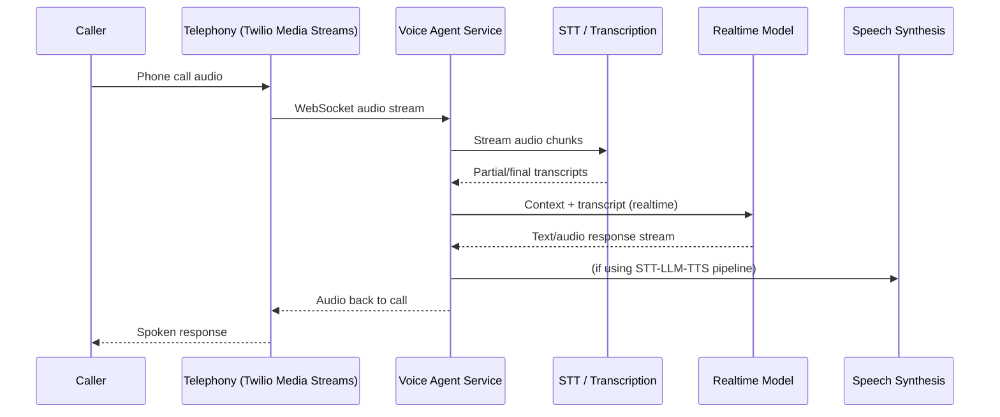

# 

- **Prompt/LLMOps practices** such as prompt versioning and online A/B testing loops. citeturn13view0turn28search3turn28search7  

Therefore, the missing content is less about “basic concepts” and more about **ecosystem-level stacks** that practitioners now expect as default options (2023–2026), plus “how-to” coverage for integrating them into reliable systems.

## High-impact missing topic themes for 2023–2026

### Standards and interoperability in production telemetry

The book emphasises LLM-specific observability platforms (Langfuse/LangSmith/Phoenix) rather than the **vendor-neutral telemetry substrate** that many organisations standardise on: **OpenTelemetry**, including its **GenAI semantic conventions** defining spans/metrics/events for model calls, tool calls, and agent workflows. citeturn6view0turn15search0turn15search36  
This is a pragmatic gap because it affects portability across APM stacks (e.g., exporters/collectors and existing governance pipelines). citeturn15search0turn18search9turn15search8  

### Authorisation and policy enforcement for tool-using agents

The book covers sandboxing and agent safety mechanisms, but it does not surface (at TOC level) the practical, widely adopted **policy engines** for centrally controlling tool execution and access. citeturn2view0turn11view0  
OPA describes “policy as code” with a decoupled decision engine via Rego, and Cedar is a purpose-built policy language used in authorisation services and explicitly in tool-gateway contexts (e.g., agent gateways). citeturn15search2turn15search10turn15search3turn15search11turn15search15  

### Ingestion and data engineering for RAG as a first-class pipeline

The book treats retrieval and chunking deeply, but does not foreground the “boring-but-critical” ingestion pipeline stack (connectors, incremental refresh, format parsing, clean-room transformations). citeturn2view0turn20search15  
Modern tooling in this space is explicit and evolving quickly: Airbyte for connectors, Unstructured and Tika for document parsing/extraction, and orchestrators like Dagster/Prefect for repeatable scheduled ingestion. citeturn19search0turn18search8turn19search1turn19search2turn19search3  

### Specialised modern implementations that have become “expected knowledge”

GraphRAG is a clear example: the book includes knowledge-graph RAG conceptually, but the 2024–2026 ecosystem now includes canonical, widely referenced implementations (Microsoft GraphRAG, Neo4j GraphRAG). citeturn2view0turn20search4turn20search0turn20search9  
Similarly, real-time voice agents and on-device inference have matured into standard product categories with clear tooling choices. citeturn24search1turn24search4turn25search1turn25search0  

## Missing topics table

The table below is intentionally **tool-anchored**: each entry is a topic the book should add (or elevate into a dedicated section/lab) because it maps to a concrete 2023–2026 stack used in research prototypes and production systems.

> Notes on interpretation: “Missing” here means **not clearly represented as a first-class topic in the TOC** and/or **not covered as an end-to-end, hands-on implementation** in the sampled chapters. citeturn1view0turn2view0turn6view0turn3view0turn11view0

| Missing topic                                          | Short description                                                                                                                                                                  | Why it matters                                                                                                                                                                                                                       | Suggested subtopics/sections                                                                                                                                   | Concrete tools/libraries/frameworks (primary sources)                                                                                                                                                                                                                                                                   | Example lab or capstone exercise                                                                                                                                                                                                      | Estimated implementation effort | Priority  |
| ------------------------------------------------------ | ---------------------------------------------------------------------------------------------------------------------------------------------------------------------------------- | ------------------------------------------------------------------------------------------------------------------------------------------------------------------------------------------------------------------------------------ | -------------------------------------------------------------------------------------------------------------------------------------------------------------- | ----------------------------------------------------------------------------------------------------------------------------------------------------------------------------------------------------------------------------------------------------------------------------------------------------------------------- | ------------------------------------------------------------------------------------------------------------------------------------------------------------------------------------------------------------------------------------- | ------------------------------- | --------- |
| OpenTelemetry GenAI observability                      | Teach standards-based tracing/metrics/events for LLM calls, tool calls, and agent workflows using OpenTelemetry GenAI semantic conventions, plus collector pipelines and redaction | Many orgs already standardise on OpenTelemetry for APM; GenAI semantic conventions now exist for consistent telemetry across providers and frameworks citeturn15search0turn15search36turn15search4turn15search20               | GenAI spans/events/metrics; collector-based governance (sampling/redaction); mapping to vendor backends; correlation with application traces; privacy controls | OpenTelemetry GenAI semantic conventions citeturn15search0turn15search4turn15search20; OpenLLMetry (OTel extensions) citeturn18search5; example OTel+Prometheus+Jaeger+Grafana guide citeturn18search9                                                                                                       | “Instrument the same RAG+agent app two ways”: (1) Langfuse (existing), (2) OpenTelemetry GenAI. Export to Jaeger/Grafana and compare what breaks, what’s portable, and how to redact prompts safely                                   | Medium                          | Critical  |
| Policy-as-code authorisation for agents                | Introduce central authorisation for tool use: mapping user/tenant/tool/action to allow/deny decisions independent of agent reasoning                                               | Tool-using agents create real access risk; sandboxing is not equal to authorisation, and modern stacks separate “policy decision” from “policy enforcement” citeturn11view0turn15search2turn15search10                          | RBAC/ABAC for tool calls; policy decision point (PDP) vs enforcement point (PEP); per-tool scopes; audit logs; default-deny; policy testing                    | Open Policy Agent docs (OPA/Rego) citeturn15search2turn15search10turn15search14; Cedar policy language citeturn15search3turn15search15turn15search11                                                                                                                                                          | Build an agent that can call “billing.refund()” and “crm.export()”. Implement a policy layer (OPA or Cedar) that blocks refunds above a threshold unless a human approves; add policy unit tests                                      | Medium                          | Critical  |
| AI gateways for routing, governance, and cost controls | Treat AI gateways as first-class infra: model routing, fallbacks, caching, auth, rate limits, prompt transforms, and policy hooks                                                  | The book already mentions gateways like Portkey/Helicone, but 2024–2026 practice uses them as an architectural layer for multi-model reliability and governance citeturn4view0turn21search0turn21search2turn21search1          | Gateway patterns: routing & fallbacks; caching; virtual keys; per-tenant quotas; model canaries; request/response transforms; integration with OTEL            | LiteLLM Proxy docs (OpenAI-compatible gateway) citeturn21search0turn21search4turn21search21; Portkey AI Gateway (OSS + docs) citeturn21search2turn21search13turn21search6; Helicone (AI gateway + observability) citeturn21search1; Kong AI Gateway docs citeturn21search3turn21search7turn21search20 | Capstone: deploy a gateway in front of two providers + one local endpoint. Implement routing rules (cheap model for low-risk prompts; strong model for hard prompts), caching, and per-user budgets. Measure outcome drift and cost   | High                            | Important |
| RAG ingestion pipelines and connectors                 | End-to-end ingestion: connecting sources, parsing heterogeneous files, incremental indexing, deduplication, scheduled refresh, and data quality checks                             | RAG quality is often dominated by ingestion correctness rather than retrieval tricks; students and engineers need the “data plumbing” playbook citeturn2view0turn20search15                                                      | Connectors; PDF/HTML/Office parsing; chunking at ingestion; incremental refresh; versioned indices; data quality & reproducibility; lineage                    | Airbyte connectors docs citeturn19search0turn19search8turn19search20; Unstructured OSS + docs citeturn18search8turn18search16turn18search12; Apache Tika extraction toolkit citeturn19search1turn19search25; orchestration with Dagster/Prefect citeturn19search2turn19search3                        | Lab: build a “living knowledge base” pipeline: nightly ingestion from (i) a repo wiki export, (ii) a drive folder, (iii) a ticket CSV. Parse with Unstructured/Tika, track versions, and rebuild a vector index only for changed docs | High                            | Critical  |
| GraphRAG implementation suites                         | Practical GraphRAG pipelines: graph extraction, community summaries, graph-based retrieval and evaluation using canonical toolchains                                               | GraphRAG became a mainstream enterprise pattern after 2024; there are now reference implementations and benchmark datasets that can be taught directly citeturn20search4turn20search0turn20search12                             | Graph extraction pipeline; community detection & summaries; hybrid retrieval (graph + vector + fulltext); evaluation datasets; failure modes                   | Microsoft GraphRAG repo + docs citeturn20search0turn20search4turn20search24; GraphRAG benchmarking datasets citeturn20search12; Neo4j GraphRAG Python package citeturn20search5turn20search9                                                                                                                | Capstone: implement a GraphRAG pipeline for a domain corpus. Compare: naive RAG vs GraphRAG on a benchmark set; report faithfulness + retrieval precision; run ablations on community summarisation depth                             | High                            | Important |
| Reproducible agent benchmarks beyond “toy evals”       | A practical chapter on running and extending agent benchmarks (web agents, tool-user agents, safety benchmarks) with reproducible harnesses                                        | Benchmarks have specialised (GAIA, τ-bench, WebArena, AgentBench, safety suites). Researchers and students need a “how to evaluate agents” cookbook, not just metric definitions citeturn23search0turn23search7turn23academia40 | Selecting benchmarks by capability; harness setup; deterministic scoring; sim users vs real users; safety-policy evaluation; logging for replay                | WebArena repo citeturn23search0; WebArena-Verified citeturn23search4turn23search20; AgentBench repo citeturn23search1; τ-bench paper+repo citeturn23search7turn23search11; Agent-SafetyBench (paper/repo) citeturn23academia40                                                                         | Lab: run one agent across 3 benchmarks (e.g., WebArena, τ-bench, AgentBench). Require trace capture + failure taxonomy. Students must propose 3 architecture changes and re-measure                                                   | High                            | Critical  |
| Agentic software engineering evaluation and curricula  | A hands-on track for coding agents and repo-level tasks using SWE-bench and related datasets/harnesses                                                                             | SWE-bench has become the de facto “realistic coding agent” benchmark, including Verified (human-filtered) and live/updated variants citeturn22search0turn22search1turn22search8turn22search26                                  | Running SWE-bench locally; patch validation; sandboxed test execution; contamination and reproducibility; comparing agent scaffolds                            | SWE-bench repo citeturn22search0turn22search5; SWE-bench Verified overview + OpenAI post citeturn22search1turn22search26; SWE-bench Live repo citeturn22search8                                                                                                                                              | Capstone: build a minimal coding agent scaffold that attempts a subset of SWE-bench Verified. Students must implement (1) repo checkout, (2) test running, (3) patch application, (4) guarded tool execution, then report pass rate   | High                            | Important |
| Real-time voice agents and telephony integration       | Dedicated voice-agent engineering: streaming audio, turn detection, barge-in, latency budgets, telephony gateways, and evaluation                                                  | “Voice” is in the TOC, but 2024–2026 practice is a specialised systems topic with WebRTC/telephony streaming stacks and non-trivial reliability constraints citeturn2view0turn24search0turn24search2turn24search1              | WebRTC vs WebSockets trade-offs; ephemeral keys; duplex audio; STT-LLM-TTS vs realtime models; telephony streaming; safety constraints                         | OpenAI Realtime API + WebRTC guide citeturn24search4turn24search0turn24search7; LiveKit Agents framework docs citeturn24search1turn24search5turn24search18; Twilio Media Streams docs + examples repo citeturn24search2turn24search9turn24search27                                                       | Build a voice agent that answers calls: Twilio streams audio via WebSockets; agent transcribes (local or cloud), answers via realtime model, and logs latency/turn-taking errors. Add a “handoff to human” rule                       | High                            | Critical  |
| Edge and on-device LLM deployment                      | Practical guidance for running and optimising LLMs on laptops and mobile devices: quantisation formats, memory limits, deployment toolchains                                       | On-device is now a mainstream requirement for privacy, offline operation, and cost; toolchains (MLX/ExecuTorch/llama.cpp/Ollama) are mature enough for curricula citeturn25search0turn25search1turn25search9turn25search2      | Quantisation trade-offs; local serving APIs; battery/thermal constraints; packaging models; evaluation under constraints                                       | MLX repo/docs citeturn25search0turn25search3turn25search10; ExecuTorch docs/repo citeturn25search1turn25search4turn25search15; llama.cpp repo citeturn25search9; Ollama repo citeturn25search2                                                                                                          | Lab: run a small open-weight model locally, measure latency vs quality across 2 quantisation levels, and deploy an “offline RAG” prototype with local embeddings and a local inference server                                         | Medium                          | Important |
| Human feedback tooling for LLMOps                      | Concretely teach how to collect, curate, and version human feedback and preference data, integrating it with evals and training loops                                              | The book explains feedback loops conceptually, but teams need practical tooling for annotation workflows and dataset governance citeturn13view0turn28search7turn28search1                                                       | Annotation UI design; preference data for DPO/RLHF; linking traces → datasets; reviewer guidelines; inter-annotator agreement                                  | Label Studio OSS citeturn28search0turn28search4; Argilla feedback platform citeturn28search1turn28search19turn28search22; LangSmith dataset management (for trace→dataset loops) citeturn28search7turn28search37                                                                                           | Lab: define a rubric for “hallucination vs acceptable uncertainty”, collect 200 labelled examples from traces, compute agreement, and use the dataset to gate a prompt/model upgrade                                                  | Medium                          | Important |
| Supply-chain security for agent sandboxes              | Extend sandboxing beyond isolation into dependency provenance: SBOMs, vulnerability scanning, signing, and safe CI patterns for agent containers                                   | Agents run arbitrary code and install dependencies; recent real-world incidents show that CI tooling and actions can be attack targets, so provenance matters citeturn11view0turn26search9turn26search33                        | SBOM generation; container scanning; signing + verification; immutable references; CI hardening for agent images                                               | Trivy scanner repo citeturn26search0; Syft SBOM generator citeturn26search1; Cosign signing docs citeturn26search2turn26search14; SLSA framework/spec citeturn26search8turn26search5turn26search19                                                                                                       | Capstone: produce a hardened “agent-runner” container image: generate SBOM, scan with Trivy, sign with Cosign, and enforce signature verification at deploy time. Document threat model and controls                                  | Medium                          | Critical  |

## Mapping table for repos, starter templates, and datasets

This table is designed as a “drop-in syllabus accelerator”: for each missing topic, it lists a small number of credible repos/templates/datasets that can anchor hands-on labs.

| Missing topic                                          | Recommended code repos                                                                                                                                                                                                                   | Starter templates                                                                                                                           | Datasets / benchmarks                                                                                                                                                                                                                                                           |
| ------------------------------------------------------ | ---------------------------------------------------------------------------------------------------------------------------------------------------------------------------------------------------------------------------------------- | ------------------------------------------------------------------------------------------------------------------------------------------- | ------------------------------------------------------------------------------------------------------------------------------------------------------------------------------------------------------------------------------------------------------------------------------- |
| OpenTelemetry GenAI observability                      | OpenTelemetry GenAI semantic conventions citeturn15search0turn15search4; OpenLLMetry repo citeturn18search5                                                                                                                       | Use OTel Collector pipeline; integrate with OTel+Prometheus+Jaeger+Grafana walkthrough citeturn18search9                                 | Use your own app traces + replay sets; optionally validate span schemas against GenAI conventions citeturn15search0                                                                                                                                                          |
| Policy-as-code authorisation for agents                | OPA repo/docs citeturn15search14turn15search2; Cedar policy language docs citeturn15search3turn15search23                                                                                                                        | Policy test harnesses (Rego unit tests; Cedar schema validation) described in official docs citeturn15search10turn15search3             | Use τ-bench policy + tool constraints as a benchmark-style target for “correct-by-policy” behaviour citeturn23search7turn23search11                                                                                                                                         |
| AI gateways for routing, governance, and cost controls | LiteLLM repo/docs citeturn21search4turn21search0; Portkey gateway repo/docs citeturn21search13turn21search2; Helicone repo citeturn21search1                                                                                  | LiteLLM proxy deploy docs (Docker/K8s) citeturn21search11turn21search25; Portkey gateway installation/deployments citeturn21search27 | Evaluate routing policies by running the same prompt set through different routing configs; connect to eval harnesses already in the book plus SWE-bench/agent benchmarks for specialised tasks citeturn8view0turn22search0turn23search0                                   |
| RAG ingestion pipelines and connectors                 | Airbyte repo/docs citeturn19search20turn19search0; Unstructured repo/docs citeturn18search8turn18search12; Apache Tika citeturn19search1                                                                                      | Dagster docs citeturn19search2turn19search14; Prefect docs/repo citeturn19search3turn19search19                                     | Use document corpora you can legally redistribute; for evaluation add RAG benchmark slices (the book already includes a datasets/benchmarks appendix) citeturn2view0                                                                                                         |
| GraphRAG implementation suites                         | Microsoft GraphRAG repo + docs citeturn20search0turn20search4turn20search24; Neo4j GraphRAG Python repo/docs citeturn20search9turn20search5                                                                                     | Neo4j GraphRAG quickstart-style guides citeturn20search1turn20search17                                                                  | Microsoft GraphRAG benchmarking datasets citeturn20search12                                                                                                                                                                                                                  |
| Reproducible agent benchmarks beyond toy evals         | WebArena repo citeturn23search0; WebArena-Verified repo/docs citeturn23search4turn23search20; AgentBench repo citeturn23search1; τ-bench repo citeturn23search11                                                            | WebArena self-hostable environment citeturn23search0; τ-bench evaluation framework repo citeturn23search11                            | WebArena tasks citeturn23search0; WebArena-Verified tasks/evaluators citeturn23search4turn23search20; AgentBench environments citeturn23search1; τ-bench benchmark citeturn23search7turn23search11; Agent-SafetyBench (safety evaluation) citeturn23academia40 |
| Agentic software engineering evaluation and curricula  | SWE-bench repo citeturn22search0; SWE-bench Live repo citeturn22search8                                                                                                                                                            | Use official SWE-bench guidance pages and harness structure from repo/docs citeturn22search0turn22search4                               | SWE-bench dataset citeturn22search0turn22search5; SWE-bench Verified citeturn22search1turn22search26; SWE-bench Live citeturn22search8                                                                                                                               |
| Real-time voice agents and telephony integration       | OpenAI Realtime API docs citeturn24search4turn24search0turn24search21; LiveKit Agents repo/docs citeturn24search18turn24search1turn24search5; Twilio Media Streams repo/docs citeturn24search27turn24search2turn24search9 | LiveKit voice AI quickstart citeturn24search5; Twilio Media Streams Python websocket tutorial citeturn24search6                       | τ-bench supports voice/full-duplex evaluation in its framework variants citeturn23search11                                                                                                                                                                                   |
| Edge and on-device LLM deployment                      | MLX repo/docs citeturn25search0turn25search3turn25search10; ExecuTorch repo/docs citeturn25search1turn25search4turn25search15; llama.cpp repo citeturn25search9; Ollama repo citeturn25search2                           | MLX examples + mlx-lm citeturn25search5turn25search7; ExecuTorch getting started citeturn25search19                                  | Evaluate with local test sets + latency/power/thermal measurements; can reuse agent/RAG eval harness patterns from book citeturn8view0turn6view0                                                                                                                            |
| Human feedback tooling for LLMOps                      | Label Studio repo citeturn28search0; Argilla repo citeturn28search1turn28search22; LangSmith dataset/prompt management docs citeturn28search7turn28search3                                                                    | Argilla cookbook-style workflows (e.g., distilabel integration examples) citeturn28search13turn28search26                               | Build your own labelled set from production traces; integrate with LLM-as-judge and human evaluation protocols already in book citeturn8view0turn13view0                                                                                                                    |
| Supply-chain security for agent sandboxes              | Trivy repo citeturn26search0; Syft repo citeturn26search1; Cosign repo + signing docs citeturn26search2turn26search14; SLSA framework/spec citeturn26search19turn26search5turn26search8                                   | Anchore sbom-action (optional CI template) citeturn26search4turn26search20; Sigstore CI quickstart docs citeturn26search37           | Use your own container builds as artefacts; include the Trivy CI compromise (case study) as a discussion prompt on immutable pinning and provenance citeturn26search9turn26search33                                                                                         |

## Mermaid diagrams for the most “missing-but-essential” architectures

### Standards-based agent observability overlay

Why this belongs in the book: OpenTelemetry now defines **GenAI semantic conventions** for model operations and agent operations, enabling a standardised trace schema across providers and stacks. citeturn15search0turn15search36turn15search4turn15search20  

### Tool authorisation as policy-as-code

Why this belongs in the book: policy engines like OPA explicitly decouple decision-making from enforcement, and Cedar is a purpose-built language for authorisation decisions used in modern permission systems. citeturn15search2turn15search10turn15search3turn15search15  

### Real-time voice agent pipeline

Why this belongs in the book: Twilio streams call audio via WebSockets, and modern voice stacks often use WebRTC-oriented realtime model APIs or dedicated agent frameworks to meet latency/turn-taking constraints. citeturn24search2turn24search9turn24search4turn24search0turn24search1  
